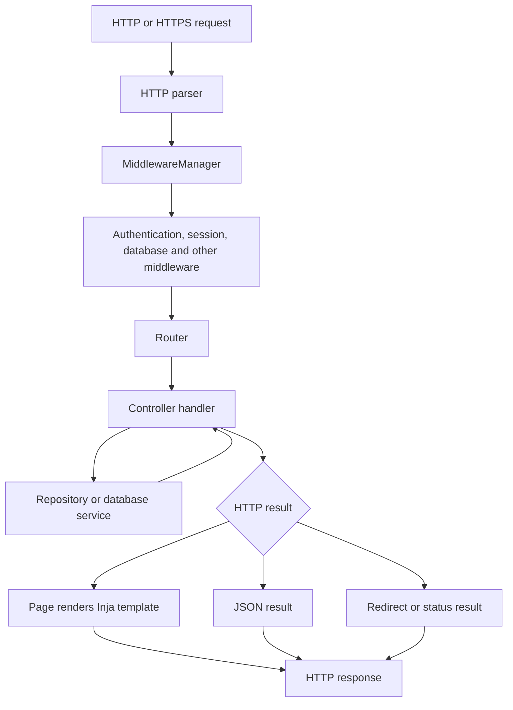

# Application Server: MVC Architecture and Request Flow

The application server follows an MVC-style design using the Tobasa web
framework. It does not have one large `Model` base class or a separate MVC
runtime. Instead, the work is split between controllers, database services
and repositories, and server-side views.

## MVC mapping

| Role | Implementation | Responsibility |
| --- | --- | --- |
| Model | Database service factory, SQL connections, repositories, entities, DTOs, and migrations | Reads and changes stored data, converts database results, and prepares the database schema. |
| View | [`web::View`](../src/page.h#L62), [`web::Page`](../src/page.h#L87), JSON view data, and Inja templates | Builds server-side HTML from a template and JSON data. |
| Controller | `CoreController`, `ApiCoreController`, `ApiUsersController`, `AdminController`, and optional LIS/test controllers | Connects routes to handlers, reads requests, calls model services, prepares page or API data, and returns an HTTP result. |

Middleware and the router support these three parts. Middleware prepares the
request and handles common work. The router finds the controller handler.

## Startup wiring

[`main.cpp`](../src/main.cpp) adds controllers through typed factories:

```cpp
webapp.addController(web::makeController<app::CoreController>(dbService));
webapp.addController(web::makeController<app::ApiUsersController>(dbService));
webapp.addController(web::makeController<app::AdminController>(dbService));
webapp.addController(web::makeController<app::ApiCoreController>(
   dbService, webapp.agent()));
```

The test and LIS controllers are added only when their modules are enabled.
[`WebService::setupHandlers()`](../../tobasaweb/src/tobasaweb/web_service.cpp#L64)
connects the middleware, controllers, and router before the server accepts
requests.

For each controller,
[`ControllerFactory::initController()`](../../tobasaweb/include/tobasaweb/controller_factory.h#L46):

1. Gives the controller the shared router.
2. Gives it the web service's database factory.
3. Calls `bindHandler()` so the controller can register routes.
4. Calls `onInit()` when the controller has one.

[`ControllerBase`](../../tobasaweb/include/tobasaweb/controller_base.h#L15) is
the common base class. The required `bindHandler()` method is where a
controller connects URLs and HTTP methods to its functions.

## Request flow

HTTP and HTTPS use the same web-service request handler. A request first goes
to the middleware manager. The manager sets up the route and then runs the
middleware chain.



The [`Router`](../../tobasaweb/include/tobasaweb/router.h#L69) matches the
HTTP method and path. The route's registered authentication scheme can be
changed by a matching route-auth rule in the configuration.

## Static-file serving

[`CoreController::onIndex()`](../src/core/core_controller.cpp#L113) handles
static files. It is also the default handler when no more specific route
matches. Static files are not handled by a separate middleware.

The document root comes from `webapp.httpServer.docRoot`. A relative path is
resolved from the executable directory.

For a request handled by `onIndex()`:

1. The path must not be empty, must start with `/`, and must not contain `..`.
   Invalid paths return `403 Forbidden`.
2. Paths starting with `/api` are not treated as files. They return a JSON
   `404 Not Found` when no API route matched.
3. A path ending in `/` gets `index.html` added.
4. `/index.html` is rendered with the `index.tpl` template through `Page`. It
   is not sent as a plain file.
5. Other paths use the configured resource mode:
   - with `useInMemoryResources` off, the server reads the file below
     `docRoot` and returns `http::fileResult()`;
   - with in-memory resources enabled in a binary built with
     `TOBASA_BUILD_IN_MEMORY_RESOURCES`, it first checks embedded `wwwroot`
     resources;
   - when the embedded file is not found, it checks the disk document root;
   - when neither location has the file, it returns `404 Not Found`.

Embedded files are returned as raw bytes with a MIME type chosen from the file
extension. Disk files use the HTTP file-result helper.

When in-memory resources are off, the controller expects both the document-root
and template directories to exist. If either is missing, normal page and file
handling returns `500 Internal Server Error`.

The build copies the repository `wwwroot/` directory beside the executable.
Embedding web files is a build-time option. Setting
`webapp.webService.useInMemoryResources` cannot add embedded files to a binary
that was not built with that option. Only files placed in the generated
`wwwroot` resource set are available in the embedded lookup.

## Controllers

### Route binding

A controller connects a path to a handler, for example:

```cpp
router()->httpGet("/api/users/{user_id:int}",
   std::bind(&ApiUsersController::onGetById, self, _1),
   AuthScheme::BEARER);
```

A route binding contains the HTTP method, path, handler, typed path values, and
the registered authentication scheme. The full route list is in
[`endpoints.md`](endpoints.md).

### Input and coordination

Handlers receive a `RouteArgument` and use it to get the `HttpContext`. They
read whatever the route needs: JSON, form data, query values, path values, or
multipart uploads. Then they call repositories or other application services.

For example,
[`ApiUsersController::onAuthenticate()`](../src/core/api_users_controller.cpp#L97):

- checks that the request uses `application/json`;
- parses the login DTO;
- uses `createAuthDbRepo()` to authenticate the user;
- records the login;
- creates access and refresh tokens;
- returns a JSON result.

The browser login handler in `CoreController` works differently. It reads form
values, updates the session and cookies, and either redirects or shows the
login page again.

Controllers are therefore more than route dispatchers. They coordinate the
request, application services, and response.

### Response types

A handler chooses how the client receives the result:

```cpp
return web::object(result);             // JSON
return page->show("dashboard.tpl");     // server-rendered HTML
return redirect("/");                   // redirect
return statusResultHtml(StatusCode::BAD_REQUEST);
```

`web::object()` creates a JSON result.
[`Page::show()`](../src/page.cpp#L199) creates an HTML result. Redirect and
status helpers return HTTP results without using a view.

## Model layer

The model part is spread across the SQL and web libraries. You use the pieces
that fit the feature instead of inheriting from one model class.

### Database services and repositories

The application creates [`DbServiceFactoryApp`](../src/database_service_factory_app.h#L14),
registers the main connector as `MainAppDbOption`, and gives the factory to the
web service and controllers. A controller can then ask for a focused
repository:

```cpp
auto authDbRepo = _dbService->createAuthDbRepo();
auto userAclDbRepo = _dbService->createUserAclDbRepo();
```

Repositories hide database operations such as login, profile and role lookup,
password changes, and user/menu/role/ACL updates. They return entities, DTOs,
collections, or operation results to the controller.

The database factory and SQL connections support the configured SQLite,
PostgreSQL, MySQL, ODBC, or ADODB backend.

### Entities and DTOs

Entities describe application data, such as a user. DTOs carry data between a
request, a repository, and a response, such as login or profile data.

A common flow is:

1. Read request data.
2. Put it into a DTO.
3. Pass the DTO to a repository.
4. Convert the returned entity or DTO into JSON or page data.

### Migrations

Migrations prepare the database before the server starts listening. `Webapp`
always registers the base migration. The test and LIS modules can add their
own migrations.

See [`database_setup.md`](database_setup.md) for the migration steps and
startup behavior.

## View layer

### `View`

`View` stores the template name, JSON data, and resource context. It also sets
common values such as `pageTitle`, `pageBaseUrl`, `pageBodyClass`, and
`pageAlerts`. Use `setData()` or the data helpers to add values for a page.

[`View::render()`](../src/page.cpp#L40) creates an Inja environment and renders
the template from the configured template directory. When embedded resources
are enabled and selected, it loads the template through `app::Resource`.

The application also registers helpers for resource URLs, dates, times, gender
formatting, array lookup, combo boxes, and generated IDs.

### `Page`

[`Page`](../src/page.h#L87) extends `View` and keeps the current
`HttpContext`. It adds request and session values such as the base URL, build
mode, home page, and session alerts.

Controllers add page-specific data:

```cpp
page->data("pageTitle", "Dashboard - Tobasa Web Service");
page->data()["identity"]["userName"] = userName;
```

`Page::show(template, context)` adds the global menu when one is available,
renders the template, and returns an HTTP result with `text/html` content. If
rendering fails, it returns an internal-server-error HTML result.

The usual page flow is:

1. Load model data in the controller.
2. Put the data into the page JSON object.
3. Render an Inja template.
4. Send the generated HTML to the client.

## Two MVC response styles

The same controller and model code supports two common response styles:

### Server-rendered pages

A page handler loads data, fills a `Page`, and calls `show()` with an Inja
template. The dashboard, login, registration, profile, and administration
pages use this style.

### JSON APIs

An API handler loads or changes data and returns a JSON result without creating
a `Page`. The client receives the JSON and decides how to display it.

## What this implementation is not

- There is no single application-wide `Model` interface. Model work is split
  between repositories, services, entities, DTOs, and migrations.
- Views do not query the database. A controller gets the data and passes it to
  the page JSON object.
- JSON API results do not go through Inja. They are returned as HTTP JSON
  results.
- The router does not run business logic or render templates. It finds and
  calls the handler.
- Middleware is not a controller or a view. It handles shared work such as
  authentication, authorization, sessions, errors, multipart parsing, request
  identification, and database checks.
- Migrations do not run for each request. They run during startup, before the
  HTTP listeners start.

## Adding an MVC feature

1. Add or reuse the entity, DTO, and repository operation needed for the data.
2. Add a controller handler that reads the request and calls the repository.
3. Register the route in `bindHandler()` with its method and authentication
   scheme.
4. Return `web::object()` for JSON, or fill a `Page` and call `show()` for
   HTML.
5. Add a migration when the feature needs new tables, columns, or default
   data.
