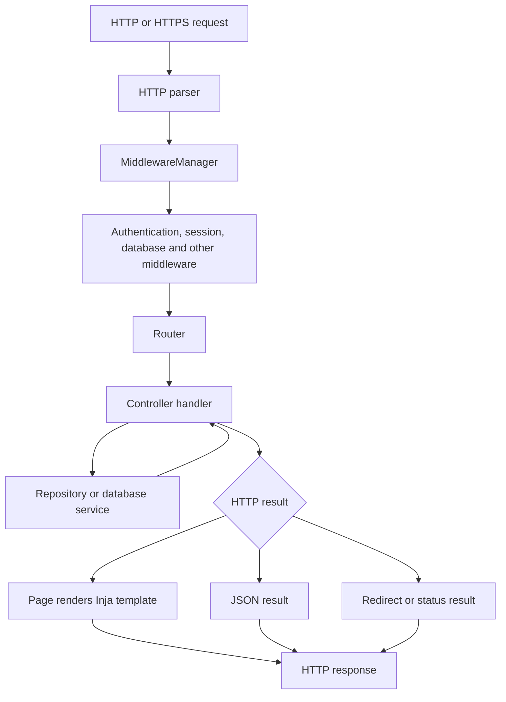

# Application Server: MVC Architecture and Request Flow

The application server uses an MVC-shaped architecture built from the Tobasa
web framework. It does not define a formal application-wide `Model` base
class or a separate MVC runtime. Instead, MVC responsibilities are divided
between controllers, repositories and database entities, and server-side
views.

## MVC mapping

| Role | Implementation | Responsibility |
| --- | --- | --- |
| Model | Database service factory, SQL connections, repositories, entities, DTOs, and migrations | Reads and changes persistent data, maps database results, and initializes the schema. |
| View | [`web::View`](../src/page.h#L62), [`web::Page`](../src/page.h#L87), JSON view data, and Inja templates | Renders server-side HTML from a template and a JSON context. |
| Controller | `CoreController`, `ApiCoreController`, `ApiUsersController`, `AdminController`, and optional LIS/test controllers | Binds routes, reads input, invokes model services, prepares view/API data, and returns an HTTP result. |

The router and middleware are supporting infrastructure. Middleware prepares
the request and applies cross-cutting behavior; the router selects the bound
controller handler.

## Startup wiring

[`main.cpp`](../src/main.cpp) adds the application controllers through typed
factories:

```cpp
webapp.addController(web::makeController<app::CoreController>(dbService));
webapp.addController(web::makeController<app::ApiUsersController>(dbService));
webapp.addController(web::makeController<app::AdminController>(dbService));
webapp.addController(web::makeController<app::ApiCoreController>(
	dbService, webapp.agent()));
```

The test and LIS controllers are conditional. [`WebService::setupHandlers()`](../../tobasaweb/src/tobasaweb/web_service.cpp#L64)
initializes middleware, initializes each controller factory, initializes the
router, and adds the router to the middleware manager.

For each controller, [`ControllerFactory::initController()`](../../tobasaweb/include/tobasaweb/controller_factory.h#L46):

1. Attaches the shared router.
2. Attaches the web service's database factory.
3. Calls the controller's `bindHandler()` method.
4. Calls the optional `onInit()` method.

[`ControllerBase`](../../tobasaweb/include/tobasaweb/controller_base.h#L15) is
the common controller base. Its required `bindHandler()`
method is where a concrete controller registers HTTP routes.

## Request flow

Both the plain and secure HTTP servers use the same web-service request
handler. The request enters the middleware manager, which calls
`Router::setupRoute()` and then runs the middleware chain.



The [`Router`](../../tobasaweb/include/tobasaweb/router.h#L69) matches both
HTTP method and path. A configured route-auth rule can
change the effective authentication decision after a controller's registered
scheme has been read.

## Static-file serving

Static-file handling is implemented by [`CoreController::onIndex()`](../src/core/core_controller.cpp#L113), which is
also the router's default handler for paths without a more specific route. It
is not a separate static-file middleware. The document root comes from
`webapp.httpServer.docRoot` and is resolved relative to the executable when
the configured path is relative.

For a request reaching this handler, the server applies these rules:

1. The path must be non-empty, start with `/`, and contain no `..`. Invalid
	paths return `403 Forbidden`.
2. Paths beginning with `/api` are not treated as static files and return a
	JSON `404 Not Found`. Matching API routes are handled by API controllers.
3. A path ending in `/` gets `index.html` appended.
4. `/index.html` is rendered from the `index.tpl` template through `Page`; it
	is not returned as a raw static file.
5. Other paths are resolved using the resource mode:
	- with `useInMemoryResources` disabled, the server reads
	  `docRoot + requestPath` from disk and returns `http::fileResult()`;
	- with in-memory resources enabled in a binary built with
	  `TOBASA_BUILD_IN_MEMORY_RESOURCES`, it first looks up
	  `wwwroot + requestPath` in the embedded `wwwroot` resources;
	- if the embedded lookup is empty, it falls back to the same path under
	  the disk document root;
	- if neither source contains the file, it returns `404 Not Found`.

Embedded content is returned as raw bytes with a MIME type selected from its
file extension. Disk content is returned through the HTTP file-result helper.
When in-memory resources are disabled, the controller requires both the
document-root and template directories to exist before normal page/file
handling; otherwise it returns `500 Internal Server Error`.

The build copies the repository's `wwwroot/` directory beside the executable.
Embedding web-root files is a build-time option; setting
`webapp.webService.useInMemoryResources` cannot create embedded resources in a
binary that was not built with that option. The embedded lookup is also not a
general filesystem search: only resources generated into the `wwwroot`
resource set are available there.

## Controllers

### Route binding

Controllers bind a path to a method-specific handler, for example:

```cpp
router()->httpGet("/api/users/{user_id:int}",
	std::bind(&ApiUsersController::onGetById, self, _1),
	AuthScheme::BEARER);
```

A binding declares the HTTP method, path (including typed parameters), handler,
and registered authentication scheme. The complete route inventory is in
[`endpoints.md`](endpoints.md).

### Input and coordination

Handlers receive a `RouteArgument` and obtain the `HttpContext`. They read
JSON bodies, form bodies, query parameters, path parameters, and multipart
uploads as required by the route. They then coordinate repositories and
application services.

For example, [`ApiUsersController::onAuthenticate()`](../src/core/api_users_controller.cpp#L97) checks for an
`application/json` body, parses a login DTO, calls `createAuthDbRepo()` to
authenticate the user, logs the login, generates access and refresh tokens,
and returns a JSON result. The browser login handler in `CoreController`
instead reads form fields, updates session/cookie state, and redirects or
renders the login page again.

Controllers therefore contain orchestration and transport decisions; they are
not only route dispatchers.

### Response types

Handlers explicitly choose their response representation:

```cpp
return web::object(result);             // JSON
return page->show("dashboard.tpl");    // server-rendered HTML
return redirect("/");                  // redirect
return statusResultHtml(StatusCode::BAD_REQUEST);
```

`web::object()` creates a JSON HTTP result. [`Page::show()`](../src/page.cpp#L199) creates an HTML
HTTP result. Redirect and status helpers return HTTP results without rendering
a view.

## Model layer

The model layer is distributed across the SQL and web libraries.

### Database services and repositories

The application creates [`DbServiceFactoryApp`](../src/database_service_factory_app.h#L14), registers the configured
connector as `MainAppDbOption`, and injects that factory into the web service
and controllers. Controllers obtain focused repositories, for example:

```cpp
auto authDbRepo = _dbService->createAuthDbRepo();
auto userAclDbRepo = _dbService->createUserAclDbRepo();
```

Repositories encapsulate operations such as user authentication, profile and
role lookup, password changes, and user/menu/role/ACL updates. They return
entities, DTOs, collections, or operation results to controllers. The
database factory and SQL connections provide the configured SQLite,
PostgreSQL, MySQL, ODBC, or ADODB backend.

### Entities and DTOs

Entities represent application data, such as users. DTOs represent data
crossing request and response boundaries, such as login and profile payloads.
Controllers convert request input into DTOs, pass them to repositories, and
convert repository results into JSON or view data.

### Migrations

Migrations are part of the data/model layer. `Webapp` always registers the
base schema migration, and the application runs the migration job before HTTP
listeners start. Optional test and LIS migrations add module-specific data.
See [`database_setup.md`](database_setup.md) for the migration lifecycle.

## View layer

### `View`

`View` owns a template name, a JSON data object, and an in-memory resource
context. It initializes common values such as `pageTitle`, `pageBaseUrl`,
`pageBodyClass`, and `pageAlerts`. `setData()` merges additional JSON data.

[`View::render()`](../src/page.cpp#L40) creates an Inja environment and renders a template from the
configured template directory. When compiled resources are enabled and
selected, it loads the template through `app::Resource` instead. Application
callbacks provide resource URLs, dates, times, gender formatting, array
lookup, combo boxes, and generated IDs.

### `Page`

[`Page`](../src/page.h#L87) extends `View` with the current `HttpContext`. Its constructor adds
request/session data such as the base URL, application build mode, home page,
and session alerts. Controllers add page-specific data:

```cpp
page->data("pageTitle", "Dashboard - Tobasa Web Service");
page->data()["identity"]["userName"] = userName;
```

`Page::show(template, context)` adds the global menu list when present, calls
`render()`, and returns an HTTP result with `text/html` content. A rendering
failure is converted to an internal-server-error HTML result.

The page controllers therefore implement server-side rendering: model data is
placed in a JSON view model, Inja evaluates the template, and the generated
HTML is returned to the client.

## Two MVC response styles

The same controller/model architecture supports two response styles:

### Server-rendered pages

A page handler loads model data, populates a `Page`, and calls `show()` with an
Inja template. This is used for dashboard, login, registration, profiles, and
administration pages.

### JSON APIs

An API handler loads or mutates model data and returns a JSON result without a
`Page`. Authentication and user-management endpoints use this style. The
client, rather than an Inja template, consumes the serialized result.

## What this implementation is not

- It has no formal application-wide `Model` interface; model behavior is in
  repositories, services, entities, DTOs, and migrations.
- Views do not query the database. Controllers obtain model data first and
  pass it into the page's JSON context.
- JSON API results are not rendered through Inja. They are built as HTTP JSON
  results.
- The router does not perform business operations or render templates. It
  selects and invokes handlers.
- Middleware is not a controller or view. It handles cross-cutting concerns
  such as authentication, authorization, sessions, errors, multipart parsing,
  request identification, and database checks.
- Migrations are not request-time model operations. They run during startup,
  before the HTTP listeners begin serving requests.

## Adding an MVC feature

1. Add or reuse an entity/DTO and repository operation for persistent data.
2. Add a controller handler that reads the request and calls the repository.
3. Register the route in `bindHandler()` with its method and authentication
	scheme.
4. Return `web::object()` for an API response, or populate a `Page` and call
	`show()` for HTML.
5. Add a migration when the feature requires schema or default-content
	changes.
