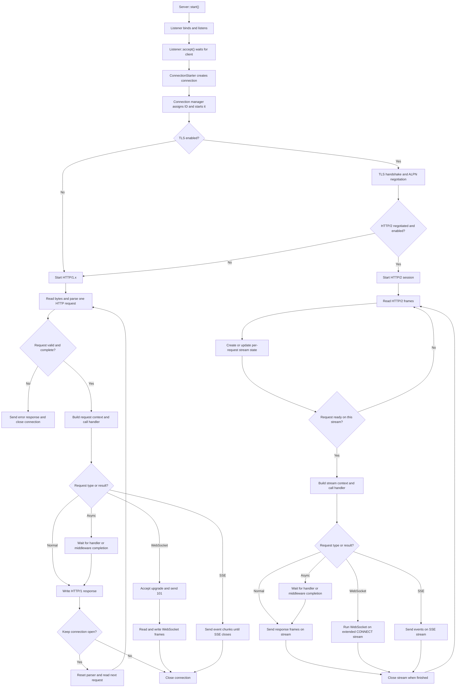

# HTTP Server Connection Handling

## Overview

The server listens for TCP connections, accepts each client, chooses an HTTP protocol, and sends complete requests to the application handler. It keeps track of active connections and closes them when the client disconnects, an error occurs, a timeout expires, or the application finishes a non-persistent connection.

HTTP/1.x handles requests one at a time on a connection. HTTP/2 can handle several request streams at once on one connection. WebSocket and Server-Sent Events (SSE) turn a normal request into a longer-lived connection or stream.

## Accepting a Client

1. `Server::start()` starts the `Listener`. The listener binds to the configured address and port and begins listening.
2. `Listener::accept()` waits asynchronously for a client socket. After accepting one, it immediately schedules another accept so new clients can continue to arrive.
3. The listener passes the socket to a `ConnectionStarter`. For a plain TCP connection, it creates a server connection directly. For TLS, it creates a TLS connection and performs the TLS handshake.
4. The connection manager assigns an ID, installs callbacks for errors, timeouts, and completion, stores the connection, and starts it.
5. On TLS connections, ALPN selects HTTP/2 (`h2`) when HTTP/2 support is enabled and negotiated. Otherwise, the server starts HTTP/1. If the build does not include HTTP/2, connections use HTTP/1.

In the current server code, HTTP/2 starts after TLS protocol negotiation. Plain TCP connections start the HTTP/1 path.

## Managing Connections

The connection manager keeps the active connection objects and handles their lifetime. It can stop one connection or stop all connections when the server shuts down. Read, write, and request-processing timers help detect clients or handlers that stop making progress.

For HTTP/1.x, one `ServerConnection` owns the socket, HTTP parser, and current request context. After the response is sent, the server checks whether the connection can stay open. If so, it resets the parser with `prepareForNextMessage()` and reads the next request. The server can also close the connection after the configured maximum number of requests. HTTP/1.1 connections stay open by default unless the request asks to close them.

For HTTP/2, one TCP connection owns an `Http2Session`. Each request gets its own stream state and request context. Streams can make progress independently, so one open stream does not normally prevent other requests from using the connection. Closing a stream releases its stream-specific state; closing the TCP connection ends the whole session.

Socket errors, parser errors, timeouts, and completed connections are reported through connection callbacks. For HTTP/1 parser errors, the server sends an error response with `Connection: close`. The connection manager removes and closes completed or failed connections.

## Processing Requests

### HTTP/1.x

`ServerConnection::read()` reads bytes from the socket and passes them to the HTTP parser. The parser reads the request line and headers, then reads the body according to `Content-Length` or chunked transfer encoding. It can also parse multipart bodies when internal multipart parsing is enabled.

When the request is ready, the server builds a request context and calls the application handler:

- `handled`: send the response.
- `notHandled`: send a `404 Not Found` response.
- `async`: wait for the handler or middleware to complete the request before sending the response.

After the response is written, the server either resets the parser and reads another request or closes the connection.

### HTTP/2

The HTTP/2 session reads bytes from the socket and passes them to nghttp2. Incoming HEADERS frames create stream state and fill in the request headers. DATA frames add body data to that stream; multipart data can be parsed as it arrives. When the request's headers or body are complete, the session creates a request context and calls the application handler for that stream.

The response is written as HTTP/2 frames on the same stream. Other streams can continue to carry requests and responses on the same connection. A stream ending does not by itself close the whole connection.

## WebSocket Requests

### HTTP/1.x WebSocket

A WebSocket starts as an HTTP request with `Upgrade: websocket`. The server calls the request handler for the upgrade. The handler must accept it and initialize a WebSocket context. The server then sends the `101 Switching Protocols` handshake response, calls the WebSocket open handler, and switches from HTTP request/response processing to WebSocket frame reads and writes.

After the upgrade, the HTTP/1 connection is dedicated to WebSocket traffic. It is not returned to the normal HTTP keep-alive request loop. Closing the WebSocket closes that connection.

### HTTP/2 WebSocket

The HTTP/2 path recognizes an extended `CONNECT` request whose protocol is `websocket`. The WebSocket runs on that HTTP/2 stream instead of upgrading the whole TCP connection. The handler must accept the request and initialize a WebSocket context. WebSocket data then travels through the stream, while other HTTP/2 streams can continue using the connection.

## Server-Sent Events

SSE keeps a response open so the server can send events over time. The application handler creates an SSE connection and adds event data to it. The server queues and sends each event as data becomes available. Closing the SSE connection ends the stream.

For HTTP/1.x, the server sends a `text/event-stream` response using chunked transfer encoding. The TCP connection remains occupied by that SSE response until it closes.

For HTTP/2, SSE uses one HTTP/2 stream. The session sends events on that stream and can continue handling other streams on the same TCP connection.

## Flowchart

