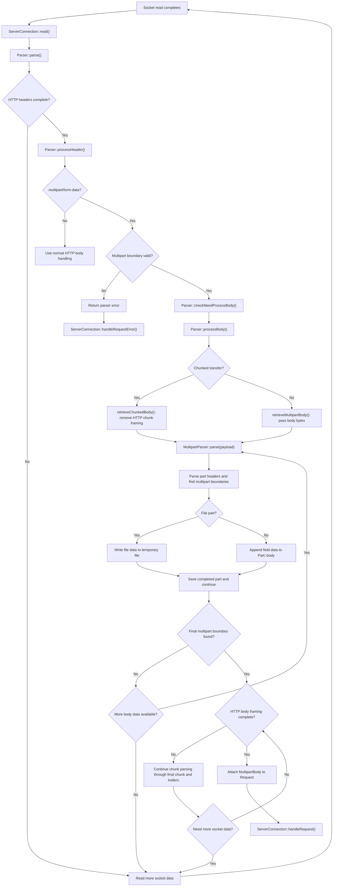

# Internal Multipart Parsing

This page describes how the HTTP server parses multipart requests itself, without asking middleware to parse the body.

## The Flow

1. **Internal parsing is enabled.** It is enabled by default with `enableMultipartParsing(true)`.

2. **The server receives the request headers.** The HTTP parser checks the `Content-Type` header. For `multipart/form-data`, it reads the boundary value. The boundary marks where each form field or file begins and ends.

3. **The parser reads the body as data arrives.** It does not wait for the whole request body before starting multipart parsing. For a request with `Transfer-Encoding: chunked`, the HTTP parser first removes the chunk sizes and framing, then passes each chunk's data to the multipart parser. Chunked transfer is just how the HTTP body is delivered; the multipart boundary still marks the form parts.

4. **The multipart parser handles each part.** It reads each part's headers and content. Ordinary form fields are kept in memory. File contents are written to temporary files as they arrive, rather than keeping the whole upload in memory.

5. **The parser waits for the end of the request body.** It continues reading and parsing until the multipart closing boundary is found and, for chunked requests, the final HTTP chunk and any trailers are consumed.

6. **The server gives the parsed result to the request handler.** Once parsing is complete, the server attaches the `MultipartBody` to the request and calls the handler. The handler can then read the form fields and access uploaded files through their temporary-file locations.

In short: the server parses the upload while receiving it, but the normal request handler is called after the complete multipart request has been received and parsed.

## Functions Involved

The main path is:

`ServerConnection::read()` -> `Parser::parse()` -> `Parser::parseWithOwnParser()` -> `Parser::processHeader()` -> `Parser::checkNeedProcessBody()` -> `Parser::processBody()`

1. `SettingsBase::enableMultipartParsing()` controls the setting. It defaults to `true`. `HttpConnection` passes the setting into its `Parser` when it is constructed.

2. `ServerConnection::read()` receives bytes from the socket and calls `Parser::parse(bytesTransferred)`.

3. `Parser::parse()` calls `parseWithOwnParser()`. When the HTTP headers are complete, `processHeader()` checks the content type, creates a `MultipartParser`, reads the multipart boundary, and records whether the body is chunked or has a content length.

4. `checkNeedProcessBody()` chooses the internal parsing path because multipart parsing is enabled. It calls `processBody()` to handle the body data.

5. `processBody()` selects how to read the body:
	- With `Content-Length`, it calls `retrieveMultipartBody()`, which passes the available body bytes to `MultipartParser::parse()`.
	- With `Transfer-Encoding: chunked`, it calls `retrieveChunkedBody()`. That function reads each HTTP chunk's size and framing, then passes only the chunk data to `MultipartParser::parse()`. It calls `chunkedMultipart(true)` to tell the multipart parser that the body length is not known in advance.

6. Inside `MultipartParser::parse()`, the parser finds multipart boundaries and reads each part's headers with `parseHeaders()`. It calls `MultipartContext::initializePart()` to determine whether the part is a normal field or a file. As part data arrives, it adds field data to the part's `body` or writes file data to its temporary file. `MultipartContext::savePart()` adds a completed part to the `MultipartBody`. A tail buffer preserves bytes that might be the start of a boundary split across reads.

7. When the final multipart boundary is found, `MultipartParser::parse()` marks multipart parsing complete. For chunked requests, `retrieveChunkedBody()` continues until the final HTTP chunk and trailers are consumed too.

8. `ServerConnection::read()` keeps reading while the HTTP parser reports that the body is incomplete. Once complete, it moves `Parser::multipartBody()` onto the request and calls `handleRequest()`.

The middleware path is different: when `enableMultipartParsing(false)` is set, the server creates a `MultipartBodyReader` and returns control to the request handler to consume the body. That path is not the internal parsing flow described above.

## Full Call Stack

The following shows the request-time path when internal multipart parsing is enabled. The parser may stop at any point when it needs more socket data; the server starts another read and the same path continues with the new bytes.

```text
ServerConnection::read()
	socket read completes
	Parser::parse(bytesTransferred)
		Parser::parseWithOwnParser(bytesTransferred)
			Parser::parseRequestStartLine(...)
			Parser::retrieveHeaders(...)
				parseHeaders(...)
			Parser::processHeader(...)
				Parser::parseContentLength(...)
				Parser::parseChunkedEncoding()
				MediaType::parse(...)
				MultipartParser::applyBoundary(...)
				Parser::checkNeedProcessBody(...)
					Parser::processBody(...)
						+-- Content-Length body
						|     Parser::retrieveMultipartBody(...)
						|       MultipartParser::parse(data, size)
						|
						+-- Chunked body
									Parser::retrieveChunkedBody(...)
										read chunk size and framing
										MultipartParser::chunkedMultipart(true)
										MultipartParser::parse(chunkData, chunkSize)

MultipartParser::parse(data, size)
	find the multipart boundary
	parseHeaders(...)                         [part headers]
	MultipartContext::initializePart()        [field or file]
	collect part data until the next boundary
		normal field: append to Part::body
		file: write to the temporary file
	MultipartContext::savePart(...)           [add completed part]
	MultipartContext::prepareForNextPart(...)  [repeat for next part]
	mark done at the final multipart boundary

ServerConnection::read() continues after Parser::parse() returns
	if the HTTP body is incomplete:
		ServerConnection::read()                [request more socket data]
	if the HTTP body is complete:
		Parser::multipartBody()                  [move completed multipart data]
		Request::multipartBody(...)
		ServerConnection::handleRequest()
```

If parsing fails, `Parser::parse()` returns an unsuccessful result and `ServerConnection::read()` sends it to `ServerConnection::handleRequestError()` instead of attaching a multipart body or calling the normal request handler.

## Flowchart


