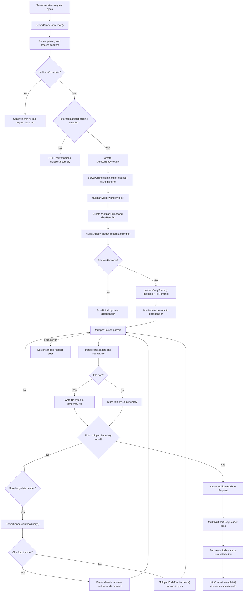

# Multipart Processing with Middleware

This page describes how multipart requests are parsed by `MultipartMiddleware`, rather than by the HTTP server's internal multipart parser.

To use this path, disable internal multipart parsing on the HTTP server and register the multipart middleware. `Webapp::useMultipart()` does not add the middleware when internal multipart parsing is enabled.

## The Flow

1. **The server reads the HTTP request headers.** The HTTP parser recognizes `multipart/form-data`, checks its boundary, and records whether the body uses `Content-Length` or chunked transfer encoding. It does not parse the multipart parts in this mode.

2. **The server creates a body reader and starts the request pipeline.** `ServerConnection` stores the `MultipartBodyReader` in the request context and calls the application handler while the body is still arriving. The reader keeps the body bytes already received and a callback for requesting more data.

3. **The multipart middleware starts asynchronously.** `MultipartMiddleware::invoke()` creates a `MultipartParser`, configures the boundary and body mode, and installs a data handler on the body reader. It returns `RequestStatus::async`, so the server does not send the response before upload parsing finishes.

4. **The reader sends body data to the middleware's data handler.** For a `Content-Length` request, it first sends the body bytes already in the server's read buffer. Later, `ServerConnection::readBody()` passes new bytes to `MultipartBodyReader::feed()`. For chunked requests, the HTTP parser removes the chunk framing and sends only chunk payloads to the same data handler.

5. **The middleware parser handles parts as data arrives.** `MultipartParser::parse()` finds part boundaries and reads part headers. Form-field data is stored in memory; file data is written to temporary files. If a boundary is split between buffers, the parser keeps the possible boundary bytes and checks them when the next data arrives.

6. **The middleware completes and resumes the pipeline.** When `MultipartParser::done()` reports the final multipart boundary, the middleware attaches the `MultipartBody` to the request and marks the body reader done. It then calls the next middleware or handler and completes the HTTP context. The server can now finish the asynchronous request and send its response.

If parsing fails, the data handler returns an error and the server handles it as a request error instead of resuming the normal middleware pipeline.

## Functions Involved

The setup and request-dispatch path is:

`Webapp::useMultipart()` -> `ServerConnection::read()` -> `Parser::parse()` -> `Parser::processHeader()` -> `ServerConnection::makeBodyReader()` -> `ServerConnection::handleRequest()` -> `MultipartMiddleware::invoke()`

1. `Webapp::useMultipart()` registers `MultipartMiddleware` when internal multipart parsing is disabled.

2. `ServerConnection::read()` calls `Parser::parse()`. The parser reaches `processHeader()`, recognizes the multipart content type, and marks the request as multipart. Since internal parsing is disabled, `Parser::checkNeedProcessBody()` returns control to the server instead of parsing the multipart parts itself.

3. `ServerConnection::makeBodyReader()` creates the `MultipartBodyReader`, including the body bytes already in the current read buffer and a callback that starts `ServerConnection::readBody()` when more data is needed. The server stores the reader in the context and calls `handleRequest()` to start the application pipeline.

4. `MultipartMiddleware::invoke()` creates and configures a `MultipartParser`, then creates a `dataHandler` that calls `MultipartParser::parse()`. It passes that handler to `MultipartBodyReader::read()` and returns `RequestStatus::async`.

5. `MultipartBodyReader::read()` calls `doRead()`:
	 - For `Content-Length`, `doRead()` sends the initial body bytes directly to `dataHandler`.
	 - For chunked transfer, `doRead()` calls the parser's `processBodyStarter`. The HTTP parser runs `processBody()` and `retrieveChunkedBody()`, which decodes the chunk framing and invokes `parseChunkedMultipartHandler`. That callback goes through `MultipartBodyReader::chunkedHandler()` and `parseChunkedData()` to reach `dataHandler`.

6. For later socket reads, `ServerConnection::readBody()` sends fixed-length data through `MultipartBodyReader::feed()`. For chunked data, it calls `Parser::parse()` again so the HTTP parser can decode the chunks and forward their payloads to the reader's chunked handler.

7. The `dataHandler` in `MultipartMiddleware::invoke()` calls `MultipartParser::parse()`. When the multipart parser is done, the handler moves its `MultipartBody` onto the request, calls `MultipartBodyReader::done(true)`, invokes the next middleware, and calls `HttpContext::complete()` with the next handler's status.

## Full Call Stack

The request pipeline starts before the multipart body has been fully read. The multipart middleware then pauses the response path while the body reader gathers and parses the remaining data.

```text
Webapp::useMultipart()
	register MultipartMiddleware

ServerConnection::read()
	socket read completes
	Parser::parse(bytesTransferred)
		Parser::parseWithOwnParser(bytesTransferred)
			Parser::processHeader(...)
				detect multipart/form-data and boundary
				Parser::checkNeedProcessBody(...)
					return control to server because internal parsing is disabled
	ServerConnection::makeBodyReader(...)
	ServerConnection::handleRequest()
		application middleware pipeline
			MultipartMiddleware::invoke(context)
				create MultipartParser
				configure boundary and transfer mode
				MultipartBodyReader::read(dataHandler)
					MultipartBodyReader::doRead()
						+-- Content-Length
						|     dataHandler(initialBodyBytes)
						|
						+-- Chunked transfer
									processBodyStarter()
										Parser::processBody(...)
											Parser::retrieveChunkedBody(...)
												parseChunkedMultipartHandler(payload)
													MultipartBodyReader::chunkedHandler()
														MultipartBodyReader::parseChunkedData(...)
															dataHandler(payload)
				return RequestStatus::async

dataHandler(data, size)
	MultipartParser::parse(data, size)
		parse part headers and boundaries
		MultipartContext::initializePart()
		collect field data or write file data
		MultipartContext::savePart(...)
		repeat until final boundary
	if MultipartParser::done():
		Request::multipartBody(...)
		MultipartBodyReader::done(true)
		next middleware or request handler
		HttpContext::complete(...)

For each later socket read while the body reader is not done:
	ServerConnection::readBody()
		+-- Content-Length: MultipartBodyReader::feed(...) -> dataHandler(...)
		+-- Chunked: Parser::parse(...) -> retrieveChunkedBody(...)
										-> chunked handler -> dataHandler(...)
```

## Flowchart


